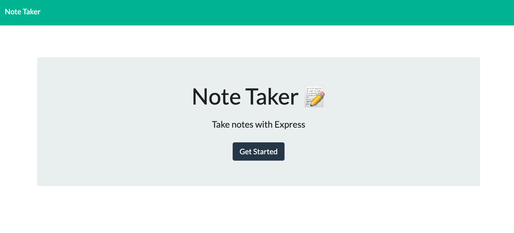
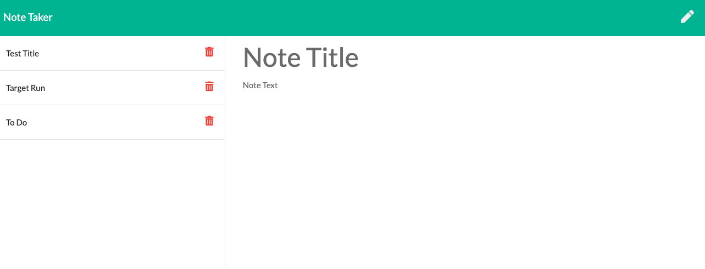

# NoteTaker
Note Taker is an application that can be used to write, save, and delete notes. The user of this app will be able to create new notes and save them. When the user no longer needs or wants the note, they are able to simply delete the note. The Note Taker app helps the user to be more organized and stay on top of their responsibilities. This will also provide them with written information available when needed. 

## Usage
To use this app, the user will click get started on the Home page. They will be navigated to a second page where they can write the new note. Click on the pencil icon in the upper right corner to start a new note. Click on the floppy dosk image to save the note. Once saved, the note will appear on the left side of the screen. To delete the note, click on the trashcan.

## License

## Questions
Please contact me at alberte.laventure@gmail.com with any questions.

## Images

